# EPIP - Enterprise Policy Insight Platform

> 最后更新：2026-01-06T19:49:12+0800

## 变更记录 (Changelog)

| 日期 | 版本 | 描述 |
|------|------|------|
| 2026-01-06 | 1.1.0 | 增量更新：为 9 个后端模块生成 CLAUDE.md（db、query、reasoning、verification、visualization、admin、cache、monitoring、benchmark） |
| 2026-01-06 | 1.0.0 | 初始化项目架构文档，完成全仓扫描与模块识别 |

---

## 项目愿景

EPIP（Enterprise Policy Insight Platform）是一套围绕政策情报与知识治理打造的实验性平台，整合多租户管理、知识图谱推理与可视化监控能力，帮助团队快速搭建端到端的洞察系统。

核心能力：
- 多租户隔离与 RBAC 权限控制
- 基于 Light-RAG 的知识图谱构建与检索
- ReAct 推理链与幻觉检测
- 知识图谱可视化与推理轨迹追踪
- Prometheus 监控与健康检查

---

## 架构总览

EPIP 采用**模块化单体架构**（Modular Monolith），以 Light-RAG 框架为核心构建知识图谱系统。系统由四个主要层次组成：

1. **数据层**：Neo4j（图数据库）+ Redis（缓存）
2. **核心处理层**：Light-RAG（KG 构建）+ ReAct（推理引擎）
3. **服务层**：FastAPI（REST API）+ 查询引擎 + 幻觉检测
4. **展示层**：React 18 + TypeScript + D3.js（可视化）

技术栈：
- 后端：Python 3.10+, FastAPI, Neo4j, Redis, Light-RAG
- 前端：React 18, TypeScript, Vite, Tailwind CSS, Zustand
- 部署：Docker Compose, Prometheus
- LLM：阿里云通义千问 / Ollama（本地）

---

## 模块结构图

```mermaid
graph TD
    A["(根) EPIP"] --> B["src/epip"];
    A --> C["frontend"];
    A --> D["scripts"];
    A --> E["tests"];
    A --> F["docs"];
    A --> G["data"];

    B --> B1["api"];
    B --> B2["core"];
    B --> B3["db"];
    B --> B4["query"];
    B --> B5["reasoning"];
    B --> B6["verification"];
    B --> B7["visualization"];
    B --> B8["admin"];
    B --> B9["cache"];
    B --> B10["monitoring"];
    B --> B11["benchmark"];

    C --> C1["src/pages"];
    C --> C2["src/components"];

    D --> D1["import_data.py"];
    D --> D2["kg_cli.py"];
    D --> D3["query_cli.py"];

    E --> E1["unit"];
    E --> E2["integration"];
    E --> E3["acceptance"];
    E --> E4["benchmark"];

    click B1 "./src/epip/api/CLAUDE.md" "查看 API 模块文档"
    click B2 "./src/epip/core/CLAUDE.md" "查看核心模块文档"
    click B3 "./src/epip/db/CLAUDE.md" "查看数据库模块文档"
    click B4 "./src/epip/query/CLAUDE.md" "查看查询模块文档"
    click B5 "./src/epip/reasoning/CLAUDE.md" "查看推理模块文档"
    click B6 "./src/epip/verification/CLAUDE.md" "查看验证模块文档"
    click B7 "./src/epip/visualization/CLAUDE.md" "查看可视化模块文档"
    click B8 "./src/epip/admin/CLAUDE.md" "查看管理模块文档"
    click B9 "./src/epip/cache/CLAUDE.md" "查看缓存模块文档"
    click B10 "./src/epip/monitoring/CLAUDE.md" "查看监控模块文档"
    click B11 "./src/epip/benchmark/CLAUDE.md" "查看基准测试模块文档"
    click C "./frontend/CLAUDE.md" "查看前端模块文档"
    click D "./scripts/CLAUDE.md" "查看脚本工具文档"
```



---

## 模块索引

| 模块路径 | 语言 | 职责 | 入口文件 | 文档 |
|---------|------|------|---------|------|
| `src/epip/api/` | Python | REST API 路由、中间件、依赖注入 | `routes.py`, `main.py` | [查看](./src/epip/api/CLAUDE.md) |
| `src/epip/core/` | Python | KG 构建、查询引擎、幻觉检测、实体/关系提取 | `kg_builder.py`, `query_engine.py` | [查看](./src/epip/core/CLAUDE.md) |
| `src/epip/db/` | Python | Neo4j 与 Redis 客户端封装 | `neo4j_client.py`, `redis_client.py` | [查看](./src/epip/db/CLAUDE.md) |
| `src/epip/query/` | Python | 查询解析、Cypher 生成、实体链接 | `parser.py`, `cypher.py` | [查看](./src/epip/query/CLAUDE.md) |
| `src/epip/reasoning/` | Python | ReAct 推理循环、问题分解、结果聚合 | `react.py`, `decomposer.py` | [查看](./src/epip/reasoning/CLAUDE.md) |
| `src/epip/verification/` | Python | 事实验证、溯源、推理轨迹记录 | `fact_verifier.py`, `trace.py` | [查看](./src/epip/verification/CLAUDE.md) |
| `src/epip/visualization/` | Python | 可视化数据生成（图谱、轨迹、验证报告） | `data_generator.py` | [查看](./src/epip/visualization/CLAUDE.md) |
| `src/epip/admin/` | Python | 多租户管理、RBAC、审计日志 | `tenant.py`, `rbac.py` | [查看](./src/epip/admin/CLAUDE.md) |
| `src/epip/cache/` | Python | 查询缓存、指纹计算 | `query_cache.py`, `fingerprint.py` | [查看](./src/epip/cache/CLAUDE.md) |
| `src/epip/monitoring/` | Python | Prometheus 指标、健康检查 | `metrics.py` | [查看](./src/epip/monitoring/CLAUDE.md) |
| `src/epip/benchmark/` | Python | 性能基准测试 | `query_benchmark.py` | [查看](./src/epip/benchmark/CLAUDE.md) |
| `frontend/` | TypeScript | React 前端应用（仪表盘、查询、可视化、管理） | `src/main.tsx`, `src/App.tsx` | [查看](./frontend/CLAUDE.md) |
| `scripts/` | Python | CLI 工具（数据导入、质量评估、基准测试） | `import_data.py`, `kg_cli.py` | [查看](./scripts/CLAUDE.md) |
| `tests/` | Python | 单元/集成/验收/性能测试 | `conftest.py` | - |
| `docs/` | Markdown | 架构、API 参考、PRD、测试策略 | `architecture.md`, `api-reference.md` | - |

---

## 运行与开发

### 本地开发

```bash
# 1. 安装后端依赖
make install

# 2. 配置环境变量
cp .env.example .env
# 编辑 .env，填写 Neo4j、Redis、LLM API 等配置

# 3. 启动后端服务（热重载）
make run  # 默认监听 http://127.0.0.1:8000

# 4. 启动前端开发服务器
make frontend-install
make frontend-dev  # 默认监听 http://localhost:5173
```

### Docker 部署

```bash
# 构建并启动所有服务
make docker-build
make docker-up

# 查看日志
make docker-logs

# 关闭服务
make docker-down
```

### 数据导入

```bash
# 查看导入状态
python scripts/import_data.py --status

# 开始导入（支持断点续传）
python scripts/import_data.py

# 重试失败文件
python scripts/import_data.py --retry-failed
```

---

## 测试策略

- **单元测试**：覆盖核心业务逻辑（KG 构建、查询引擎、推理、验证）
- **集成测试**：验证 API 端点、数据库交互、组件协作
- **验收测试**：质量指标验证（实体精度、关系覆盖率、图密度）
- **性能测试**：查询响应时间、并发负载、缓存命中率

运行测试：
```bash
make test  # 运行所有测试并生成覆盖率报告
make lint  # 代码检查（Ruff + mypy）
make format  # 代码格式化
```

---

## 编码规范

- **Python**：遵循 PEP 8，使用 Ruff 格式化，mypy 类型检查
- **TypeScript**：遵循 ESLint 规则，使用 Prettier 格式化
- **命名约定**：
  - Python：`snake_case`（函数、变量）、`PascalCase`（类）
  - TypeScript：`camelCase`（函数、变量）、`PascalCase`（组件、类型）
- **文档字符串**：所有公共函数/类必须包含 docstring
- **测试覆盖率**：核心模块要求 ≥90%

---

## AI 使用指引

### 推荐工作流

1. **理解需求**：先阅读 `docs/prd.md` 和相关 Story 文档
2. **查看架构**：参考 `docs/architecture.md` 了解模块划分与数据流
3. **定位模块**：根据需求找到对应模块的 `CLAUDE.md`
4. **修改代码**：遵循编码规范，保持模块边界清晰
5. **编写测试**：确保测试覆盖率达标
6. **更新文档**：修改后更新相关 `CLAUDE.md` 的变更记录

### 常见任务

- **添加新 API 端点**：修改 `src/epip/api/routes.py`，添加对应 schema 到 `src/epip/api/schemas/`
- **扩展查询能力**：修改 `src/epip/query/parser.py` 或 `src/epip/query/cypher.py`
- **优化 KG 构建**：调整 `src/epip/core/kg_builder.py` 或 Light-RAG 配置
- **添加前端页面**：在 `frontend/src/pages/` 创建新组件，更新 `App.tsx` 路由

### 关键配置文件

- `.env` / `.env.local`：环境变量配置
- `pyproject.toml`：Python 依赖与工具配置
- `frontend/package.json`：前端依赖与脚本
- `docker/docker-compose.yml`：容器编排配置

---

## 常见问题 (FAQ)

**Q: 如何切换 LLM 后端？**
A: 修改 `.env` 中的 `LLM_BINDING`（`ollama` 或 `openai`）和相关 API 配置。

**Q: 如何清理缓存？**
A: 调用 `POST /api/cache/clear` 或使用前端管理页面。

**Q: 如何备份数据？**
A: 运行 `make backup`，备份文件保存在 `backups/` 目录。

**Q: 前端如何连接后端？**
A: 前端通过 Vite 代理（开发环境）或 Nginx（生产环境）连接后端 API。

**Q: 如何调试推理链？**
A: 访问 `/api/visualization/trace/{trace_id}` 查看 ReAct 推理步骤详情。

---

## 相关文档

- [架构文档](./docs/architecture.md)
- [API 参考](./docs/api-reference.md)
- [PRD](./docs/prd.md)
- [测试策略](./docs/test-strategy.md)
- [部署指南](./docs/deployment-guide.md)
- [配置参考](./docs/configuration.md)

---

## 许可证

本项目当前以 **UNLICENSED** 形式发布，尚未对外开放使用许可。如需获取授权，请联系项目维护者。
