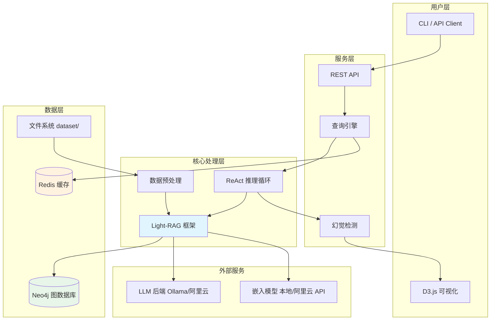
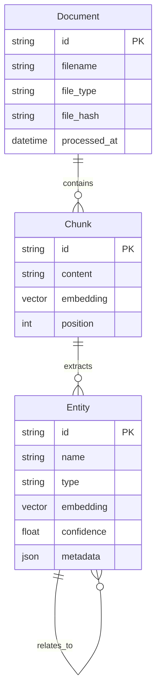
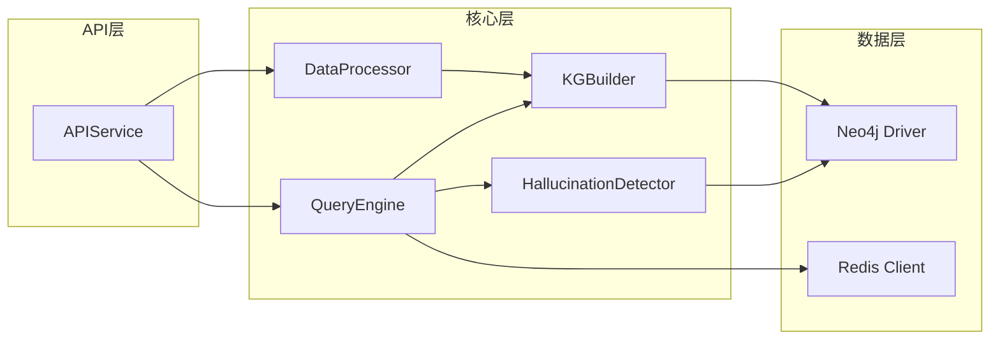
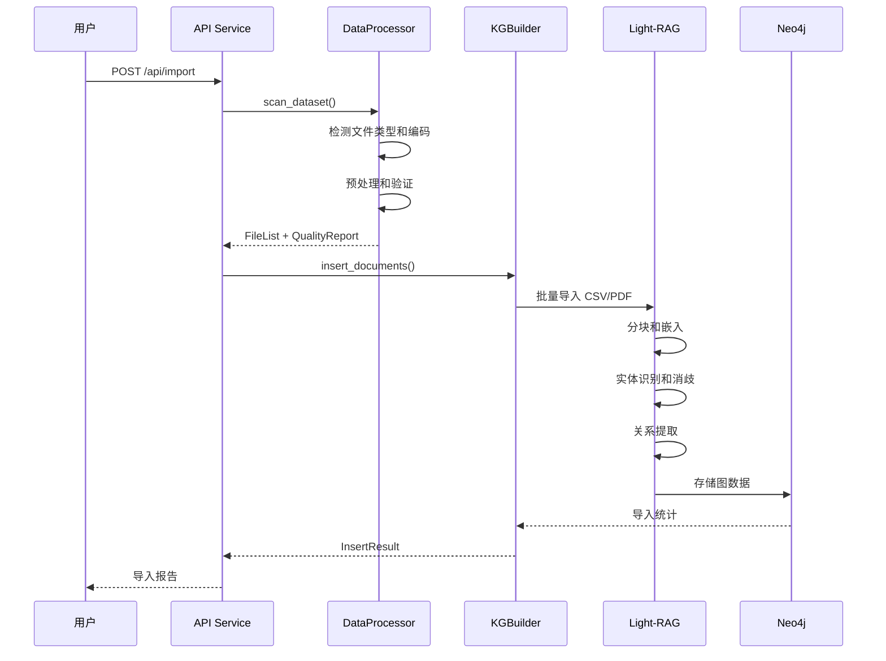
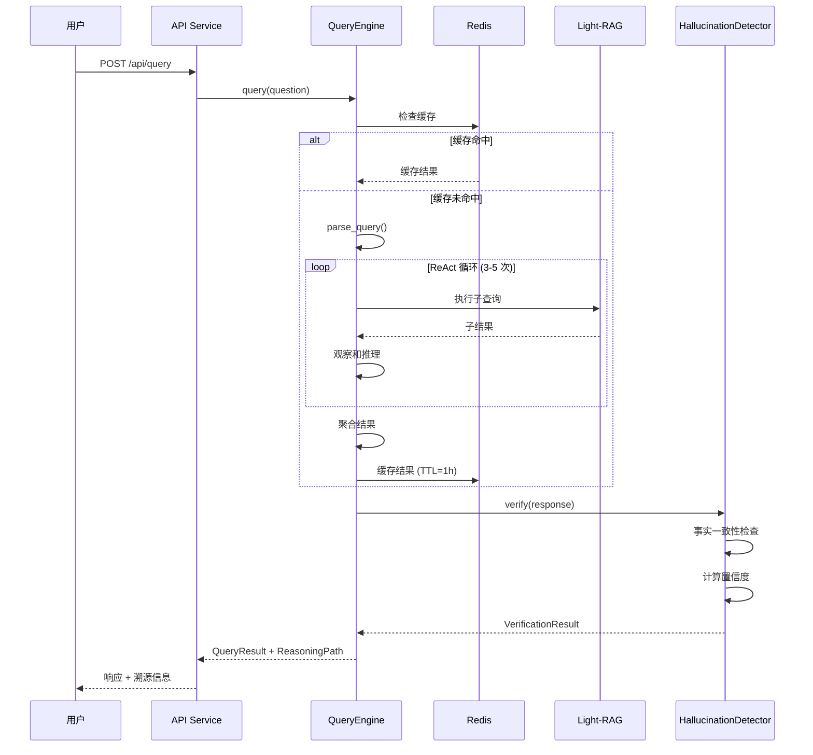

# EPIP 企业政策洞察平台 - 架构文档

**版本**: 1.0
**日期**: 2025-12-31
**状态**: 草稿

---

## 1. 引言

本文档概述了 EPIP（企业政策洞察平台）的整体项目架构，包括后端系统、数据处理管道和知识图谱构建。其主要目标是作为 AI 驱动开发的架构蓝图，确保一致性并遵循所选的模式和技术。

**与 PRD 的关系**：本架构基于 `docs/prd.md` 中定义的需求和技术假设，实现 PRD 中描述的功能模块和质量指标。

### 1.1 启动模板

**N/A** - 本项目从零开始构建，不使用现有启动模板。

### 1.2 变更日志

| 日期 | 版本 | 描述 | 作者 |
|------|------|------|------|
| 2025-12-31 | 1.0 | 初始架构文档创建 | Architect Agent |

---

## 2. 高层架构

### 2.1 技术摘要

EPIP 采用**模块化单体架构**，以 Light-RAG 框架为核心构建知识图谱系统。系统由四个主要层次组成：数据层（Neo4j + Redis）、核心处理层（Light-RAG + ReAct）、服务层（API + 查询引擎）和展示层（D3.js 可视化）。

关键技术选择包括：Python 3.10+ 作为主开发语言，Light-RAG 处理 KG 构建，Neo4j 存储图数据，Redis 提供查询缓存。整体架构支持本地部署，确保数据隐私合规，同时预留微服务拆分接口以支持未来扩展。

### 2.2 高层概述

1. **架构风格**: 模块化单体 (Modular Monolith)
   - 按功能模块划分，模块间通过明确接口通信
   - 便于快速迭代，降低初期复杂度
   - 预留微服务拆分边界

2. **仓库结构**: Monorepo
   - 单一仓库管理所有模块
   - 统一版本控制和依赖管理

3. **服务架构**: 单进程多模块
   - 核心模块：数据处理、KG构建、查询引擎、幻觉检测
   - 外部服务：Neo4j（图数据库）、Redis（缓存）

4. **主要数据流**:
   ```
   CSV/PDF 数据 → 数据预处理 → Light-RAG → Neo4j KG
                                              ↓
   用户查询 → 查询解析 → ReAct 推理 → 幻觉检测 → 响应
   ```

### 2.3 高层架构图



### 2.4 架构和设计模式

| 模式 | 描述 | 理由 |
|------|------|------|
| **模块化单体** | 单进程部署，模块间明确边界 | 快速迭代，降低初期运维复杂度 |
| **管道模式 (Pipeline)** | 数据处理流水线 | 清晰的数据转换流程，易于扩展 |
| **仓库模式 (Repository)** | 抽象数据访问层 | 解耦业务逻辑与数据存储 |
| **策略模式 (Strategy)** | LLM 后端可切换 | 支持 Ollama/OpenAI 等多种后端 |
| **装饰器模式 (Decorator)** | 幻觉检测包装 | 透明增强查询结果 |
| **缓存旁路 (Cache-Aside)** | Redis 查询缓存 | 提升热门查询性能 |

---

## 3. 技术栈

### 3.1 基础设施

- **部署方式**: 本地部署 (Docker)
- **容器编排**: Docker Compose
- **监控**: Prometheus + Grafana

### 3.2 技术栈详情

| 类别 | 技术 | 版本 | 用途 | 理由 |
|------|------|------|------|------|
| **语言** | Python | 3.10+ | 主开发语言 | AI/ML 生态丰富，Light-RAG 原生支持 |
| **KG 框架** | Light-RAG | 最新 | 知识图谱构建与检索 | 轻量级 GraphRAG，支持 CSV/PDF，内置实体识别 |
| **图数据库** | Neo4j | 5.x | 图数据存储 | 成熟稳定，Cypher 查询，GDS 算法库 |
| **缓存** | Redis | 7.x | 查询缓存 | 高性能，支持 TTL |
| **向量嵌入** | sentence-transformers / 阿里云 text-embedding-v4 | 2.x / v4 | 文本嵌入 | 本地推理 + 远程 API 备选 |
| **LLM** | Ollama / 阿里云通义千问（qwen-plus） | - | 查询解析、推理 | 本地优先，兼容云端大模型 |
| **SDK** | openai SDK | 1.x | LLM/嵌入 API 客户端 | OpenAI 兼容接口 |
| **数据处理** | pandas | 2.x | CSV 预处理 | 标准库，功能丰富 |
| **可视化** | D3.js | 7.x | 推理树可视化 | 灵活，交互性强 |
| **Web框架** | FastAPI | 0.100+ | REST API | 异步支持，自动文档 |
| **容器** | Docker | 24.x | 容器化部署 | 标准化，可移植 |
| **编排** | Docker Compose | 2.x | 多服务编排 | 简单高效 |
| **测试** | pytest | 7.x | 测试框架 | Python 标准，插件丰富 |
| **代码质量** | ruff | 0.1+ | Linting | 快速，规则全面 |
| **类型检查** | mypy | 1.x | 静态类型检查 | 提升代码质量 |

---

## 4. 数据模型

### 4.1 知识图谱核心模型

#### 4.1.1 Entity（实体节点）

**用途**: 表示知识图谱中的核心实体（如政策、统计指标、机构等）

**关键属性**:
- `id`: string - 唯一标识符
- `name`: string - 实体名称
- `type`: string - 实体类型（Policy, Statistic, Organization, etc.）
- `source_file`: string - 来源文件路径
- `embedding`: vector - 向量嵌入
- `confidence`: float - 置信度分数
- `metadata`: json - 扩展元数据

**Neo4j 标签**: `Entity`, `{EntityType}`

#### 4.1.2 Relationship（关系边）

**用途**: 表示实体间的关系

**关键属性**:
- `type`: string - 关系类型（AFFECTS, CONTAINS, RELATED_TO, etc.）
- `weight`: float - 关系权重
- `source`: string - 来源
- `confidence`: float - 置信度

#### 4.1.3 Document（文档节点）

**用途**: 表示原始数据文档（CSV/PDF）

**关键属性**:
- `id`: string - 唯一标识符
- `filename`: string - 文件名
- `file_type`: string - 文件类型（csv/pdf）
- `file_hash`: string - 文件哈希（用于增量处理）
- `processed_at`: datetime - 处理时间
- `chunk_count`: int - 分块数量

#### 4.1.4 Chunk（分块节点）

**用途**: 表示文档分块

**关键属性**:
- `id`: string - 唯一标识符
- `content`: string - 分块内容
- `embedding`: vector - 向量嵌入
- `position`: int - 在文档中的位置

### 4.2 实体关系图



---

## 5. 组件

### 5.1 数据预处理模块 (DataProcessor)

**职责**: 处理原始 CSV/PDF 数据，生成 Light-RAG 可接受的输入

**关键接口**:
- `scan_dataset(path: str) -> List[FileInfo]`
- `preprocess_csv(file: Path) -> DataFrame`
- `validate_data(df: DataFrame) -> QualityReport`

**依赖**: pandas, chardet

**技术细节**:
- 自动检测文件编码（UTF-8/GBK）
- 缺失值处理策略可配置
- 生成数据质量报告

### 5.2 Light-RAG 核心模块 (KGBuilder)

**职责**: 使用 Light-RAG 构建和管理知识图谱

**关键接口**:
- `insert_documents(files: List[Path]) -> InsertResult`
- `configure(params: LightRAGConfig) -> None`
- `get_statistics() -> KGStats`

**依赖**: lightrag, neo4j-driver, sentence-transformers

**技术细节**:
- 封装 Light-RAG 的核心 API
- 支持 CSV 和 PDF 批量导入
- 参数调优接口
- 支持中文 Prompt 优化（chinese_prompts.py）
- 支持远程 Embedding API（阿里云 text-embedding-v4）

### 5.3 查询引擎模块 (QueryEngine)

**职责**: 处理自然语言查询，执行 ReAct 推理循环

**关键接口**:
- `query(question: str) -> QueryResult`
- `parse_query(question: str) -> QueryPlan`
- `execute_cypher(cypher: str) -> GraphResult`

**依赖**: lightrag, neo4j-driver, redis

**技术细节**:
- ReAct 循环实现（Reason → Act → Observe）
- 支持分解为 3-5 个子查询
- 集成 Redis 缓存

### 5.4 幻觉检测模块 (HallucinationDetector)

**职责**: 验证生成内容的事实一致性

**关键接口**:
- `verify(response: str, context: GraphContext) -> VerificationResult`
- `trace_path(result: QueryResult) -> ReasoningPath`
- `get_confidence(result: QueryResult) -> float`

**依赖**: sentence-transformers

**技术细节**:
- 语义匹配验证
- 数值一致性检查
- 置信度评分（阈值 0.7）

### 5.5 API 服务模块 (APIService)

**职责**: 提供 REST API 接口

**关键接口**:
- `POST /api/query` - 执行查询
- `POST /api/import` - 导入数据
- `GET /api/health` - 健康检查
- `GET /api/stats` - KG 统计

**依赖**: FastAPI, uvicorn

### 5.6 组件图



---

## 6. 核心工作流

### 6.1 数据导入工作流



### 6.2 查询处理工作流



---

## 7. 数据库 Schema

### 7.1 Neo4j 图 Schema

```cypher
// 节点约束
CREATE CONSTRAINT entity_id IF NOT EXISTS FOR (e:Entity) REQUIRE e.id IS UNIQUE;
CREATE CONSTRAINT document_id IF NOT EXISTS FOR (d:Document) REQUIRE d.id IS UNIQUE;
CREATE CONSTRAINT chunk_id IF NOT EXISTS FOR (c:Chunk) REQUIRE c.id IS UNIQUE;

// 索引
CREATE INDEX entity_name IF NOT EXISTS FOR (e:Entity) ON (e.name);
CREATE INDEX entity_type IF NOT EXISTS FOR (e:Entity) ON (e.type);
CREATE INDEX document_hash IF NOT EXISTS FOR (d:Document) ON (d.file_hash);

// 向量索引 (Neo4j 5.x)
CREATE VECTOR INDEX entity_embedding IF NOT EXISTS
FOR (e:Entity) ON (e.embedding)
OPTIONS {indexConfig: {
  `vector.dimensions`: 384,
  `vector.similarity_function`: 'cosine'
}};
```

### 7.2 Redis 缓存结构

```
# 查询缓存
query:{hash} -> JSON(QueryResult)  # TTL: 3600s

# 统计缓存
stats:kg -> JSON(KGStats)  # TTL: 300s

# 热门查询
hot_queries -> ZSET(query_hash, score)
```

---

## 8. 项目结构

```
epip/
├── src/
│   └── epip/
│       ├── __init__.py
│       ├── main.py                 # 应用入口
│       ├── config.py               # 配置管理
│       │
│       ├── api/                    # API 层
│       │   ├── __init__.py
│       │   ├── routes.py           # 路由定义
│       │   ├── schemas.py          # Pydantic 模型
│       │   └── dependencies.py     # 依赖注入
│       │
│       ├── core/                   # 核心业务逻辑
│       │   ├── __init__.py
│       │   ├── data_processor.py   # 数据预处理
│       │   ├── kg_builder.py       # KG 构建
│       │   ├── chinese_prompts.py  # 中文优化提示词
│       │   ├── llm_backend.py      # LLM 后端策略
│       │   ├── query_engine.py     # 查询引擎
│       │   └── hallucination.py    # 幻觉检测
│       │
│       ├── db/                     # 数据访问层
│       │   ├── __init__.py
│       │   ├── neo4j_client.py     # Neo4j 客户端
│       │   └── redis_client.py     # Redis 客户端
│       │
│       └── utils/                  # 工具函数
│           ├── __init__.py
│           ├── logging.py          # 日志配置
│           └── helpers.py          # 辅助函数
│
├── tests/
│   ├── __init__.py
│   ├── conftest.py                 # pytest 配置
│   ├── unit/                       # 单元测试
│   │   ├── test_data_processor.py
│   │   ├── test_kg_builder.py
│   │   └── test_query_engine.py
│   └── integration/                # 集成测试
│       ├── test_api.py
│       └── test_pipeline.py
│
├── scripts/
│   ├── setup_db.py                 # 数据库初始化
│   └── import_data.py              # 数据导入脚本
│
├── dataset/                        # 原始数据（已存在）
│   ├── 香港主要医疗卫生统计数字/
│   ├── 住院病人统计/
│   └── ...
│
├── data/                           # 处理后数据
│   ├── processed/                  # 预处理结果
│   └── cache/                      # 本地缓存
│
├── docs/                           # 文档
│   ├── prd.md
│   └── architecture.md
│
├── docker/
│   ├── Dockerfile
│   └── docker-compose.yml
│
├── pyproject.toml                  # 项目配置
├── requirements.txt                # 依赖列表
├── Makefile                        # 常用命令
├── .env.example                    # 环境变量模板
├── .gitignore
└── README.md
```

---

## 9. 部署架构

### 9.1 Docker Compose 配置

```yaml
# docker-compose.yml
version: '3.8'

services:
  app:
    build:
      context: .
      dockerfile: docker/Dockerfile
    ports:
      - "8000:8000"
    environment:
      - NEO4J_URI=bolt://neo4j:7687
      - REDIS_URL=redis://redis:6379
      - LLM_BACKEND=ollama
      - OLLAMA_URL=http://ollama:11434
    depends_on:
      - neo4j
      - redis
    volumes:
      - ./dataset:/app/dataset:ro
      - ./data:/app/data

  neo4j:
    image: neo4j:5-community
    ports:
      - "7474:7474"
      - "7687:7687"
    environment:
      - NEO4J_AUTH=neo4j/password
      - NEO4J_PLUGINS=["apoc", "graph-data-science"]
    volumes:
      - neo4j_data:/data

  redis:
    image: redis:7-alpine
    ports:
      - "6379:6379"
    volumes:
      - redis_data:/data

  ollama:
    image: ollama/ollama:latest
    ports:
      - "11434:11434"
    volumes:
      - ollama_data:/root/.ollama

volumes:
  neo4j_data:
  redis_data:
  ollama_data:
```

### 9.2 环境配置

| 环境 | 用途 | 配置 |
|------|------|------|
| **development** | 本地开发 | Docker Compose，热重载 |
| **testing** | CI/CD 测试 | Docker Compose，测试数据 |
| **production** | 生产部署 | Docker Compose，优化配置 |

### 9.3 部署流程

```
本地开发 → Git Push → CI 测试 → 镜像构建 → 本地部署
```

---

## 10. 错误处理策略

### 10.1 错误模型

- **自定义异常层次**:
  - `EPIPException` - 基类
  - `DataProcessingError` - 数据处理错误
  - `KGBuildError` - KG 构建错误
  - `QueryError` - 查询错误
  - `ValidationError` - 验证错误

### 10.2 日志标准

- **库**: Python logging + structlog
- **格式**: JSON 结构化日志
- **级别**: DEBUG, INFO, WARNING, ERROR, CRITICAL
- **必需上下文**:
  - `request_id`: 请求追踪 ID
  - `module`: 模块名称
  - `operation`: 操作名称

### 10.3 错误处理模式

| 场景 | 策略 |
|------|------|
| LLM 调用失败 | 重试 3 次，指数退避，降级到简单查询 |
| Neo4j 连接失败 | 重试连接，健康检查失败 |
| 数据验证失败 | 记录详细错误，跳过问题记录 |
| 数据导入超时 | 重试 5 次，指数退避（5s→60s），记录失败文件 |
| 查询超时 | 30 秒超时，回退到基本路径查询 |

---

## 11. 编码标准

### 11.1 核心标准

- **语言**: Python 3.10+
- **类型检查**: mypy strict 模式
- **格式化**: ruff format
- **Linting**: ruff check

### 11.2 命名约定

| 元素 | 约定 | 示例 |
|------|------|------|
| 模块 | snake_case | `query_engine.py` |
| 类 | PascalCase | `QueryEngine` |
| 函数 | snake_case | `execute_query()` |
| 常量 | UPPER_SNAKE_CASE | `MAX_RETRY_COUNT` |
| 私有 | 前缀 `_` | `_internal_method()` |

### 11.3 关键规则

- **日志**: 使用 `structlog`，禁止 `print()`
- **配置**: 通过环境变量或配置文件，禁止硬编码
- **异常**: 使用自定义异常类，包含上下文信息
- **类型提示**: 所有公共函数必须有类型注解
- **文档**: 公共 API 必须有 docstring

---

## 12. 测试策略

### 12.1 测试金字塔

- **单元测试**: 70% - 核心逻辑
- **集成测试**: 20% - 模块交互
- **E2E 测试**: 10% - 完整流程

### 12.2 测试配置

| 类型 | 框架 | 位置 | 覆盖率目标 |
|------|------|------|------------|
| 单元 | pytest | `tests/unit/` | 80% |
| 集成 | pytest + testcontainers | `tests/integration/` | 核心路径 |
| E2E | pytest | `tests/e2e/` | 关键流程 |

### 12.3 测试基础设施

- **Neo4j**: Testcontainers 启动临时实例
- **Redis**: Testcontainers 启动临时实例
- **LLM**: Mock 响应，避免实际调用

---

## 13. 安全

### 13.1 数据安全

- **本地部署**: 所有数据不外传
- **敏感配置**: 环境变量，不提交到 Git
- **日志脱敏**: 禁止记录敏感数据

### 13.2 API 安全

- **认证**: 可选 API Key（本地部署默认关闭）
- **速率限制**: 可配置，默认 100 req/min
- **CORS**: 限制允许的源

### 13.3 依赖安全

- **扫描工具**: pip-audit
- **更新策略**: 每月检查，安全补丁立即更新

---

## 14. 检查清单结果

*待架构审核通过后执行 Architect 检查清单*

---

## 15. 下一步

### 15.1 QA 提示词

```
请基于 docs/prd.md 和 docs/architecture.md 对 EPIP 项目进行早期风险分析和测试策略设计。

重点关注：
1. Light-RAG KG 构建准确性验证方案
2. 查询性能基准测试策略
3. 幻觉检测有效性评估
4. 核心质量指标的测试方法

目标指标：
- 实体准确率 >90%
- 关系覆盖率 >80%
- 查询速度提升 2-5 倍
- 幻觉率 <5%
```

### 15.2 开发提示词

```
请基于 docs/prd.md 和 docs/architecture.md 开始 EPIP 项目的 Epic 1 实现。

从 Story 1.1 开始：项目初始化与开发环境配置
- 创建项目结构
- 配置依赖管理
- 设置开发工具

参考架构文档第 8 节的项目结构。
```
